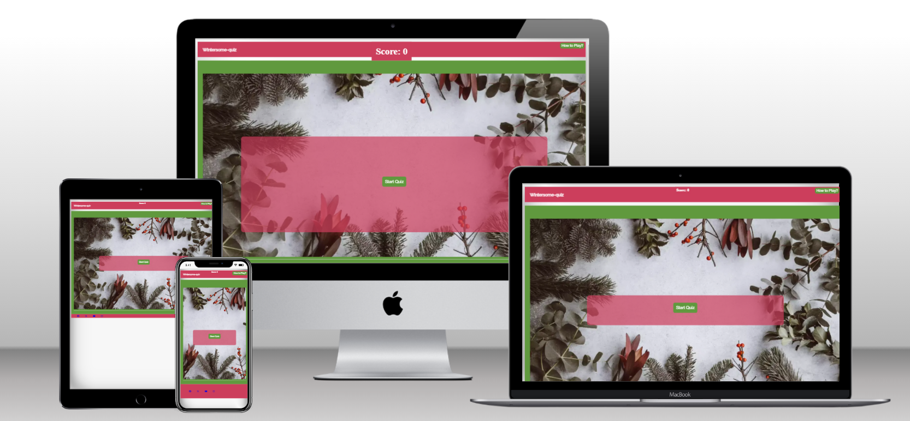
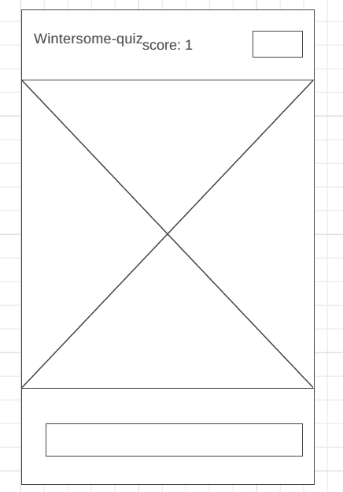
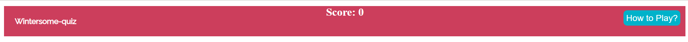

# Wintersome-quiz



This is the wintersome-quiz website. A website designed to test users on the winter season.

visit the live site [here!](https://creepersguitar.github.io/CodeInstitute-Project-2/)

## Contents
1. [Design](#design)
2. [Features](#features)
3. [Installation](#installation)
4. [Usage](#usage)
5. [Code Structure](#code-structure)
6. [UX](#ux)
7. [Testing](#testing)
8. [Sources](#sources)
9. [Credits](#credits)
10. [Contributing](#contributing)
11. [Contact](#contact)


## Design
The website was designed for anyone who wants to enjoy a fun quiz about christmas.
### Wireframe Design
- The wireframe viewpoint for the website was from [wireframe.cc](https://wireframe.cc/)


### font-choices
- The fonts were generated by using [google-fonts](https://fonts.google.com/)
- The fonts quicksand and raleway were being used to help emphasise the christmas theme aswell as still maintaining the professional look that is needed.
### colour choices
- The colours were taken from [coolors](https://coolors.co/)
- i chose these colours as they brought out the christmas theme.
- The white was used for the text and the black was being used as a backup colour for the text.
- The blue was used for the buttons on the website
- The green was used for the background of the website
- The red was used for the header, footer and the text covering the hero image

### Images
The image is taken by Annie Spratt and the image is of some winter folliage ontop of a white background.

See the image [here!](https://unsplash.com/photos/assorted-type-of-leaves-lying-on-white-panel-VDXtVYJVj7A)
## Features
The website has features of a basic live moving website.
- **header**
- The header is always visible and contains the score aswell as the name
- The header also contains a modal to conceal the rules

- **main body**
 - The main body is hidden until you click on the modal to show the rules
 - The questions appear ontop of the hero image with 5 options to click on
 - The background colour of the entire website is green (appart from the footer) to emphasise the christmas theme

- **Footer**
 - The footer has links to the signup pages of different social media websites
 - The colours on the footer are partially linked to the christmas theme as the background is red but the media logos are in blue.

### Potential Future features
 - add more difficult questions
 - add a difficulty system
 - link to a question generator
## Installation

To run the Wintersome Quiz locally, follow these steps:

1. **Clone the repository:**

   ```bash
   git clone https://github.com/yourusername/wintersome-quiz.git
2. **Navigate to the project directory:**
	cd wintersome-quiz
3. **Open index.html in your preferred web browser.**
## Usage

To start the quiz:

1. Open `index.html` in a web browser.
2. Click the "Start Quiz" button to begin.
3. Answer the questions by clicking on the corresponding buttons.
4. Your score will be displayed and updated as you proceed through the quiz.
5. After the final question, you will have the option to play again or end the game.

## Code Structure

The project consists of the following files and directories:

- `index.html`: The main HTML file that structures the webpage.
- `assets/css/style.css`: The CSS file for styling the webpage.
- `assets/javascript/script.js`: The JavaScript file containing the quiz logic.
- `assets/images/`: Directory containing image assets used in the project.
- `assets/images/readme_images`: Directory containing image assets for the readme.md file
- `assets/favicon/`: Directory containing favicon files for the webpage.

## UX
### Site Goals
The site wants to attract users that want to experience a fun quiz about all things christmas.(including shows, films, important dates and more!)
## Testing
 - i have confirmed that the website is responsive by making use of media queries from 280px - 1024px

### Fixed Bugs
 - used a undelcared variable in the JavaScript File but i made sure that the variable now works throughout the program on lines: 169,170,136,137 and 107.
 
 - line 167, the variable "playAgain" should've been "again" which it now is.
### Unfixed Bugs
- None all bugs are fixed
### Validation Testing
- HTML ([W3c Validator](https://validator.w3.org/))
- There was a stray end tag on line 38 of the html file but that is now resolved so there is no errors now given when ran through the w3c validator.
- The first image underneath this comment is to show the error, then the second image is the website re-ran through the validator to pass.
[first image](assets/images/readme_images/htmlVal_errorshown.png)
[second image](assets/images/readme_images/htmlVal_passed.png)
- CSS ([Jigsaw](https://jigsaw.w3.org/css-validator/))
- no errors mentioned within the css validation
[css-validation](assets/images/readme_images/cssJigsaw.png)
- JavaScript ([JSHint](https://jshint.com/))
- The validator says that there is three unused variables but they are in the html file not the JS file.
[JS Validation](assets/images/readme_images/jsvalidator.png)
### Browser Testing

| Browser | Layout | Functionality | (Table Taken from MariaHochstoeger. The results are my own.)
| :.....: | :....: | :...........: |
| Safari  | ✔     | ✔             |
| Chrome  | ✔      | ✔            |
| Edge    | ✔      | ✔            |
| Firefox | ✔      | ✔            |
| IE      | Depreciated by microsoft not needed to test |
### Manual Testing
- The table in this section and the section above are taken from a peer called MariaHochstoeger.
- The results on the otherhand are my own.

| Feature | Expect | Action | Result | (Table Taken from MariaHochstoeger. The results are my own.)
| :.....: | :....: | :....: | :....: |
| all buttons work | all buttons work as expected | pressed all buttons | all buttons work | 
| the rules show up when modal button is clicked | rules show up when modal clicked | click on modal | rules show up as modal button is clicked
| play again "no" button takes you to google | no button takes you to google | clicked on "no" button | button takes you to google |
| play again "yes" button refreshes the screen | screen refreshes after "yes" button is pressed |
## Deployment
This site was deployed on Github Pages:
- From the repository you are in, first navigate to "Settings" (This is at the top of the page).
- Then in the "Settings" you go to "Pages" (This is at the left of the newly opened page)
- Under "Source" you then choose "Deploy from a Branch" in the drop down menu.
- Then choose the "main" Branch, and make sure the folder "/(root)"
- You then can click "Save"
- The website is now being deployed (this may take a few minutes to do so be patient!)
- To get to your new site, click in the "Code" tab of the repository.
- Then on the right-hand side under "Environments" click on "github-pages"
- Finally on the newly opened page, on the right-hand side, click on "View deployment"
## Sources
- Favicon was generated by using [Favicon.io](https://favicon.io/)
- The fonts were generated by using [google-fonts](https://fonts.google.com/)
- The logos on the footer were from [font-awesome](https://fontawesome.com/kits)
- The wireframe viewpoint for the website was from [wireframe.cc](https://wireframe.cc/)
- The image conversion for the hero image was from [cloud-convert](https://cloudconvert.com/)
- The colours were taken from [coolors](https://coolors.co/)
- Image compression was from [youcompress](https://www.youcompress.com/webp/)
- The mock up image for the different viewpoints was from [techsini](https://techsini.com/multi-mockup/index.php)
- The hero image was taken from [unsplash](https://unsplash.com/)
- The first 3 questions were taken from [parade.com](https://parade.com/943457/parade/christmas-trivia/)
- The rest of the questions apart from the last 3 were taken from [cosmopolitan.com](https://www.cosmopolitan.com/uk/worklife/a34747711/christmas-quiz-questions/)
-  The last 3 questions were taken from [goodhousekeeping](https://www.goodhousekeeping.com/uk/christmas/christmas-countdown/a34572101/christmas-quiz/)
- The code for the modal was taken from [w3schools](https://www.w3schools.com/howto/tryit.asp?filename=tryhow_css_modal)
## Credits
- My mentor, Spencer Barribal, for his input and for showing a base demo of what the project could look like.
- w3schools for providing me with information about tips and tricks to improve my code (such as for the modal)
- Annie Spratt on unsplash for the hero image that i used.
- Goodhousekeeping.com for providing the last three questions and answers
- parade.com for providing the first three questions and answers
- cosmopolitan.com for providing the rest of the questions and answers
- Mark Butler - a fellow student who helped me to figure out a solution to a problem
- Sarah_5p - A fellow student who helped figure out the issue with the green buttons appearing before the user presses the start quiz button
- Stephen Dawson - An alumni from Code Institute who helped figure out the same issue as sarah of the green buttons appearing before the user presses the start quiz button
## Contributing

Contributions are welcome! If you would like to contribute to this project, please follow these steps:

1. Fork the repository.
2. Create a new branch (`git checkout -b feature/YourFeature`).
3. Make your changes.
4. Commit your changes (`git commit -m 'Add some feature'`).
5. Push to the branch (`git push origin feature/YourFeature`).
6. Open a pull request.

## Contact

If you have any questions or suggestions, feel free to reach out:

- GitHub: [creepersguitar](https://github.com/creepersguitar)