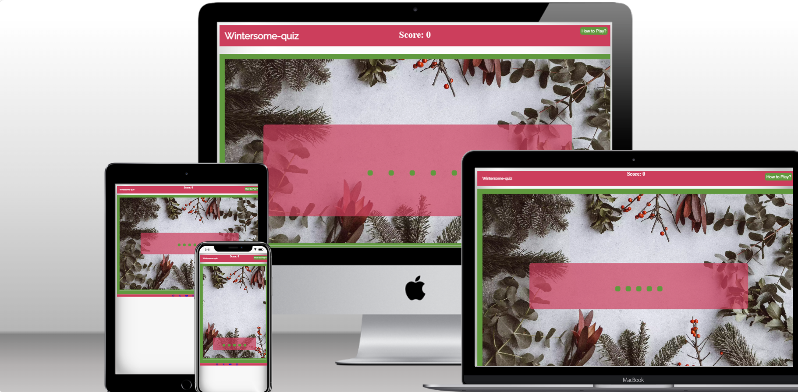

# Wintersome-quiz

This is the wintersome-quiz website. A website designed to test users on the winter season.

visit the live site [here!] (https://creepersguitar.github.io/CodeInstitute-Project-2/)

## Contents
1. [Design](#design)
2. [Features](#features)
3. [UX](#ux)
4. [Testing](#testing)
5. [Sources](#sources)
6. [Credits](#credits)

## Design

### Wireframe Design

### font-choices

### colour choices

### Images

## Features
The website has features of a basic live moving website.
- **header**
- The header is always visible and contains the score aswell as the name
- The header also contains a modal to conceal the rules

- **main body**
 - The main body is hidden until you click on the modal to show the rules
 - The questions appear ontop of the hero image with 5 options to click on
 - The background colour of the entire website is green (appart from the footer) to emphasise the christmas theme

- **Footer**
 - The footer has links to the signup pages of different social media websites
 - The colours on the footer are partially linked to the christmas theme as the background is red but the media logos are in blue.

### Potential Future features
 - add more difficult questions
 - add a difficulty system
 - link to a question generator
## UX
### Site Goals
The site wants to attract users that want to experience a fun quiz about all things christmas.(including shows, films, important dates and more!)
## Testing
 - i have confirmed that the website is responsive by making use of media queries from 280px - 1024px

### Fixed Bugs
 - used a undelcared variable in the JavaScript File but i made sure that the variable now works throughout the program on lines: 169,170,136,137 and 107.
 
 - line 167, the variable "playAgain" should've been "again" which it now is.
### Unfixed Bugs
- None as all bugs are fixed
### Validation Testing

### Browser Testing

| Browser | Layout | Functionality | (Table Taken from MariaHochstoeger. The results are my own.)
| :.....: | :....: | :...........: |
| Safari  | ✔     | ✔             |
| Chrome  | ✔      | ✔            |
| Edge    | ✔      | ✔            |
| Firefox | ✔      | ✔            |
| IE      | Depreciated by microsoft not needed to test |
### Manual Testing
| Feature | Expect | Action | Result | (Table Taken from MariaHochstoeger. The results are my own.)
| :.....: | :....: | :....: | :....: |
|
|
|
## Deployment
This site was deployed on Github Pages:
- From the repository you are in, first navigate to "Settings" (This is at the top of the page).
- Then in the "Settings" you go to "Pages" (This is at the left of the newly opened page)
- Under "Source" you then choose "Deploy from a Branch" in the drop down menu.
- Then choose the "main" Branch, and make sure the folder "/(root)"
- You then can click "Save"
- The website is now being deployed (this may take a few minutes to do so be patient!)
- To get to your new site, click in the "Code" tab of the repository.
- Then on the right-hand side under "Environments" click on "github-pages"
- Finally on the newly opened page, on the right-hand side, click on "View deployment"
## Sources
- Favicon was generated by using [Favicon.io](https://favicon.io/)
- The fonts were generated by using [google-fonts](https://fonts.google.com/)
## Credits
- My mentor, Spencer Barribal, for his input and for showing a base demo of what the project could look like.